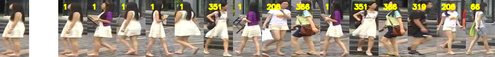

This is source code for *Visual data recognition* subject

# How to run:
Type the below command for code run procedure:
```
python reid.py -h
```
You should get:
```
usage: reid.py [-h] [-b] [-p PATH] [-t TYPE] [-m METRIC] [-r RANK]

Process some integers.

optional arguments:
  -h, --help            show this help message and exit
  -b, --benchmark       run benchmark
  -p PATH, --path PATH  path to image
  -t TYPE, --type TYPE  feature type
  -m METRIC, --metric METRIC
                        distance metric
  -r RANK, --rank RANK  rank
```
## 1. Data preparation:
```
wget -O market1501 https://www.dropbox.com/s/qllazogolszz2hq/39965_62075_bundle_archive.zip?dl=0
unzip market1501
```
## 2. Install enviroment, Ubuntu and Anaconda are required:
```
conda env create -f environment.yml
conda activate re-id
```
## 3. Run Benchmark:
We provide several features as below:
| Feature  | encode name |
| ------------- | ------------- |
| Flatten raw image  | naive  |
| Histogram of LBP | lbp  |
| Histogram of BGR  | BGR_hist  |
| Histogram of HSV | HSV_hist  |
| Histogram of HS  | HS_hist  |
| Histogram of HSV split 2_0 | HSV_hist_2_0  |
| Histogram of BGR split 2_0  | BGR_hist_2_0  |
| Histogram of BGR split 2_2  | BGR_hist_2_2  |
| Histogram of HSV split 2_2   | HSV_hist_2_2  |
| Histogram of BGR split 4_0   | BGR_hist_4_0  |
| Histogram of HSV split 4_0   | HSV_hist_4_0  |

We also provide 2 kind of Distance calculation:
| Distance  | encode name |
| ------------- | ------------- |
| Euclide Distnace  | l2_distance  |
| histogram_intersection | histogram_intersection  |

You can run experiment by:
```
python reid.py -b -t <encode name of Feature> -m <encode name of metric>
```
Example:
```
python reid.py -b -t HSV_hist_4_0 -m histogram_intersection
```
## 4. Run test:
You can run test by:
```
python reid.py -p <path to test image> -t <encode name of Feature> -m <encode name of metric> -r <rank>
```
Example:
```
python reid.py -p ./example/0001_c6s1_009601_00.jpg -t HSV_hist_4_0 -m histogram_intersection -r 15
```
The result will be store at: *result.png*\
You should get:


# Benchmark result:
|     Methods    |  Rank1 |  Rank5 | Rank10 | Rank15 | Rank20 | Feature extraction time(s)/ img  | Feature comparation time (s)/img |
|:--------------:|:------:|:------:|:------:|:------:|:------:|:--------------------------------:|:--------------------------------:|
| Naïve image_L2 | 0.0035 | 0.0115 | 0.0187 | 0.0243 | 0.0285 |            9.7095e-06            |              0.9008              |
|   BGR_H00_HI   | 0.1722 | 0.2704 | 0.3206 | 0.3536 | 0.3773 |              0.00058             |              0.4577              |
|   BGR_H20_HI   | 0.2520 | 0.3690 | 0.4266 | 0.4649 | 0.4907 |              0.00085             |              0.4992              |
|   BGR_H22_HI   | 0.2449 | 0.3580 | 0.4094 | 0.4441 | 0.4667 |              0.00139             |              0.5971              |
|   BGR_H40_HI   | 0.3147 | 0.4323 | 0.4928 | 0.5240 | 0.5489 |              0.00141             |              0.5963              |
|   HSV_H00_HI   | 0.3450 | 0.4922 | 0.5540 | 0.5899 | 0.6166 |              0.00065             |              0.4729              |
|    HS_H00_HI   | 0.2687 | 0.4192 | 0.4925 | 0.5279 | 0.5596 |              0.00048             |              0.4483              |
|   HSV_H20_HI   | 0.4314 | 0.5748 | 0.6350 | 0.6612 | 0.6873 |              0.00093             |              0.51549             |
|   HSV_H22_HI   | 0.4035 | 0.5498 | 0.6054 | 0.6395 | 0.6633 |              0.00157             |              0.63320             |
|   HSV_H40_HI   | 0.4685 | 0.6184 | 0.6852 | 0.7119 | 0.7301 |              0.00179             |              0.72152             |
|   LBP_H00_HI   | 0.0742 | 0.1401 | 0.1802 | 0.2051 | 0.2244 |              0.00130             |              0.43157             |
|   LPB_H00_L2   | 0.0492 | 0.1045 | 0.1419 | 0.1677 | 0.1840 |              0.00129             |              0.16462             |
